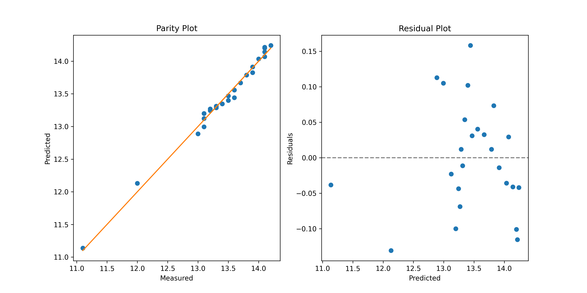
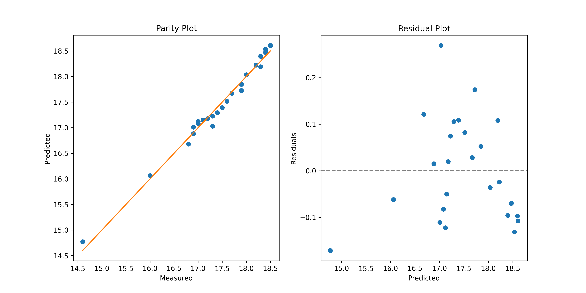
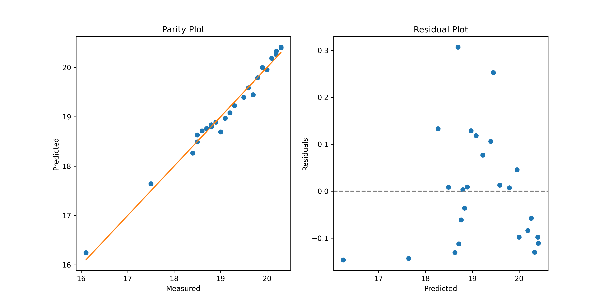

# BMI girls 0 to 2 years of zscores

## Regression parameters for -2 SD
| C | Values |
|----:|-------------:|
| 0 | 1.113820807547422e+01 |
| 1 | 1.122423541533045e+00 |
| 2 | -1.362378193192714e-01 |
| 3 | 6.321707056376615e-03 |
| 4 | -1.024778985809771e-04 |

- R^2: `0.988`
- Residual standard error: `0.074`
- F-statistic: `418.205`
- p-value: `1.110E-16`

## Regression parameters for +1 SD
| C | Values |
|----:|-------------:|
| 0 | 1.477124078987601e+01 |
| 1 | 1.468356884108020e+00 |
| 2 | -1.864953158624385e-01 |
| 3 | 8.889714039682084e-03 |
| 4 | -1.470971973231983e-04 |

- R^2: `0.984`
- Residual standard error: `0.108`
- F-statistic: `314.514`
- p-value: `1.110E-16`

## Regression parameters for +2 SD
| C | Values |
|----:|-------------:|
| 0 | 1.624649572649810e+01 |
| 1 | 1.588485186313076e+00 |
| 2 | -2.010351846227709e-01 |
| 3 | 9.545116719077998e-03 |
| 4 | -1.575115705561014e-04 |

- R^2: `0.984`
- Residual standard error: `0.120`
- F-statistic: `304.794`
- p-value: `1.110E-16`

