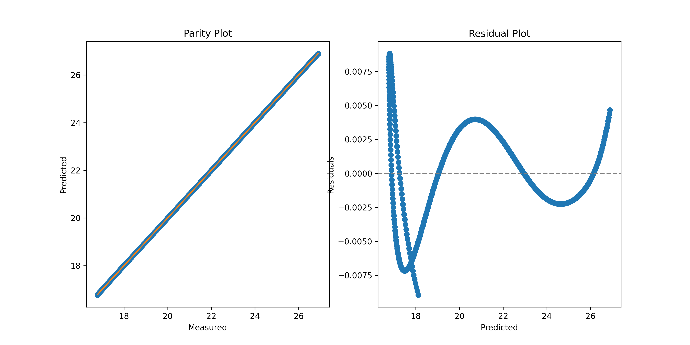

# BMI girls 2 to 20 years of zscores

## Regression parameters for -2 SD
| C | Values |
|----:|-------------:|
| 0 | 1.472376416842509e+01 |
| 1 | -2.869191111181625e-02 |
| 2 | -7.532993931178362e-05 |
| 3 | 2.930603685831956e-06 |
| 4 | -8.068896835411454e-09 |

- R^2: `1.000`
- Residual standard error: `0.002`
- F-statistic: `39552717.934`
- p-value: `1.110E-16`

## Regression parameters for +1 SD
| C | Values |
|----:|-------------:|
| 0 | 2.136366791524148e+01 |
| 1 | -1.971628673066984e-01 |
| 2 | 2.557108025076406e-03 |
| 3 | -1.015857252966421e-05 |
| 4 | 1.366563237570340e-08 |

- R^2: `1.000`
- Residual standard error: `0.003`
- F-statistic: `185223301.718`
- p-value: `1.110E-16`

## Regression parameters for +2 SD
| C | Values |
|----:|-------------:|
| 0 | 2.394062542599380e+01 |
| 1 | -2.636617264947195e-01 |
| 2 | 4.187774244140183e-03 |
| 3 | -1.944858501813683e-05 |
| 4 | 3.141614524082570e-08 |

- R^2: `1.000`
- Residual standard error: `0.009`
- F-statistic: `42256767.954`
- p-value: `1.110E-16`

